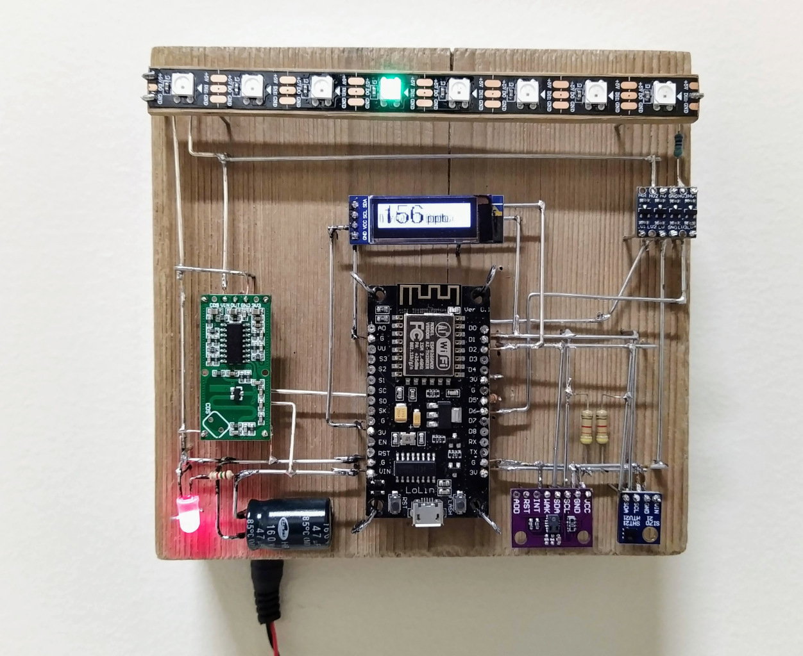
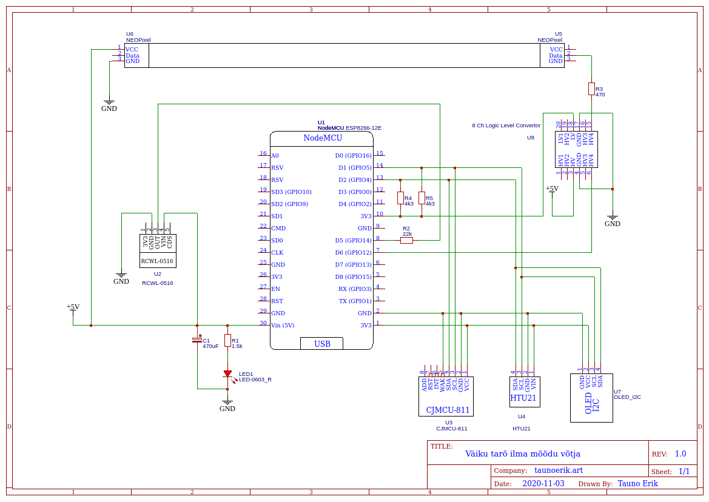

# Väiku tarõ ilma mõõdu võtja

Board:

- NodeMcu V1.0 ESP12E / Lolin ver 0.1

Sensors:

- HTU21D-F Temperature and Humidity
- CCS811 eCO2 and TVOC
- RCWL-0516 Microwave radar (motion)

Display:

- OLED SSD1306 128x32px
- NeoPixel stripe (8)

Other:

- Logic level converter

___

Copyright 2021 Tauno Erik https://taunoerik.art
